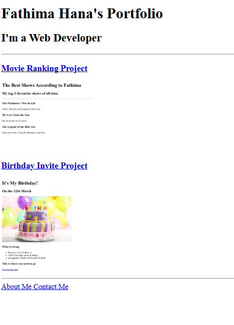

# HTML Portfolio Website – Fathima Hana

HTML | Personal Projects | Web Development

---

## Overview

A personal portfolio showcasing beginner web development projects using HTML. The homepage features links to two mini-projects—Movie Ranking and Birthday Invitation—along with About and Contact pages.

---

## Tech Stack

- *HTML5* – For content structure and navigation
- *Local Assets* – Images embedded from local directory

---

## Key Features

- Clean homepage listing individual project pages
- Image previews for each project
- Dedicated About and Contact pages
- Modular structure for easy updates and additions

---

## File Structure

`portfolio-website`/  
│  
├── `index.html` # Main portfolio page  
├── `public/`  
│   ├── `movie-ranking.html`  
│   ├── `birthday-invite.html`  
│   ├── `about.html`  
│   └── `contact.html`  
├── `assets/images/`  
│   ├── `movie-ranking.png`  
│   └── `birthday-invite.png`  
└── `README.md`  

---

## Page Descriptions

- **index.html**  
  Serves as the homepage with project previews and navigation links.

- **movie-ranking.html**  
  A simple HTML list ranking favorite movies with brief descriptions.

- **birthday-invite.html**  
  A fun party invitation webpage with event details and visuals.

- **about.html**  
  Short description about me.

- **contact.html**  
  Includes contact information.

---

## How to Run

1. Clone or download the repository.
2. Open `index.html` in any modern web browser.
3. Ensure the folder structure is maintained for images and links to work properly.

---

## Live Website

[https://fathimahana-ks.github.io/html-portfolio-website/](https://fathimahana-ks.github.io/html-portfolio-website/)

---

## Preview

---

## Contact Me

**Fathima Hana**  
📧 [fathimahanaks@gmail.com](mailto:fathimahanaks@gmail.com)  
🔗 [LinkedIn](https://www.linkedin.com/in/fathimahana/)
